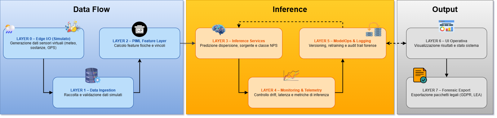
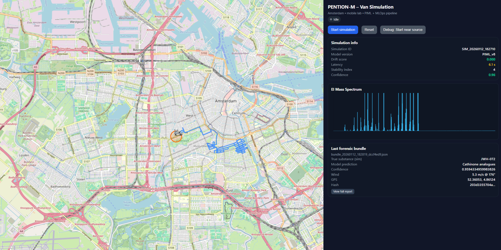

# PENTION-M  
**A Design Science Research Prototype for Mobile Detection of New Psychoactive Substances using Physics-Informed Machine Learning and MLOps**

---

## 📌 Overview

**PENTION-M** is a **research prototype** developed as part of a **Master’s Thesis in Computer Science**, grounded in the **Design Science Research (DSR)** methodology.  
The project extends the original **[PENTION-S](https://github.com/minicla03/Pention-System)** concept by introducing a **mobile, vehicle-mounted paradigm** for the detection and localization of **New Psychoactive Substances (NPS)** in open and semi-open environments.

<p align="center">
  
</p>

The system simulates a **mobile forensic laboratory** capable of:

- Detecting NPS vapours via **mass-spectrometry-based fingerprints**
- Modelling atmospheric dispersion using **physics-based Gaussian models**
- Correcting physical inaccuracies through **Physics-Informed Machine Learning (PIML)**
- Localizing emission sources
- Operating within a complete **MLOps pipeline** with monitoring, retraining, and forensic auditability

The entire framework is **containerized**, **modular**, and designed to reflect **realistic operational constraints** while remaining fully reproducible for research and evaluation purposes.

---

## 🎓 Research Context

This work was developed within the context of the **EU Horizon project PENTION**, addressing the urgent need for advanced technologies to detect **synthetic drugs and precursors**, particularly **NPS**, which are characterized by:

- Rapid chemical evolution
- Extremely low vapour pressure
- High variability and lack of comprehensive open datasets

Unlike traditional fixed installations, **PENTION-M** focuses on **mobile detection scenarios**, such as:

- Clandestine laboratories
- Open urban or industrial areas
- Vehicle-based inspections

All components beyond the NPS classifier rely on **synthetic and simulated data**, due to the absence of publicly available real-world datasets—a constraint explicitly acknowledged and addressed through simulation fidelity and validation-by-construction.

---

## 🧠 Methodological Framework

This project follows the **Design Science Research (DSR)** paradigm and integrates elements of an **Experience Report**, emphasizing:

- Iterative development driven by **stakeholder requirements**
- Continuous validation embedded in the design process
- Close interaction with practitioners and academic supervisors

### Key DSR Phases Implemented

1. **Problem Identification**  
   Detection of NPS in mobile and uncontrolled environments with legal-grade traceability

2. **Requirements Engineering**  
   - Questionnaires
   - Interviews
   - Stakeholder workshops (LEAs, researchers, industry partners)

3. **Design & Development**  
   Modular microservice architecture with physics-based simulation, PIML models, and MLOps

4. **Demonstration**  
   End-to-end system execution via UI and APIs

5. **Evaluation (By Construction)**  
   Continuous feedback-driven refinement and technical validation

6. **Reflection & Lessons Learned**  
   Documented limitations, trade-offs, and future research directions

---

## 🏗️ System Architecture

PENTION-M is organized as a **microservice-based cyber-physical system**, orchestrated via **Docker Compose**.

Core layers include:

- **User Interface (UI)** – Mobile van simulation and control
- **Sensor Simulation** – Vapour sampling and EI mass spectra generation
- **Physical Dispersion Model** – Gaussian Plume/Puff (GaussianPuff)
- **PIML Correction Models** – CNN-based correction of dispersion maps
- **Source Localization** – ML-based emission source estimation
- **NPS Classification** – XGBoost / DNN classifiers on EI spectra
- **MLOps Layer** – Monitoring, drift detection, retraining
- **Forensic Layer** – Tamper-evident forensic bundles

---

## 🧪 Main Modules

### 🔹 ClassificatoreNPS
- EI mass spectra classification
- XGBoost, Random Forest, DNN models
- Dataset: **PENTION_EI_Complete** (merged from multiple public sources)

### 🔹 GaussianPuff
- Physics-based dispersion engine (Plume & Puff)
- Atmospheric stability and wind modelling
- Sensor simulation and spatial sampling

### 🔹 CorrectionDispersion_PIML
- CNN-based correction of physical dispersion maps
- Physics-informed loss functions
- Binary urban maps derived from OpenStreetMap

### 🔹 EmissionSourceLocalization_PIML
- Physics-informed regression for emission source estimation
- Coupling between physical dispersion fields and learned corrections

### 🔹 PentionSystem_M
- Lightweight web-based UI for PENTION-M
- End-to-end orchestration of the mobile pipeline
- Real-time visualization and reporting

---

## 📁 Repository Structure

A detailed file tree is available [here](documents/project_structure.txt)

The repository contains:
- Modular Dockerized services
- Simulation and training pipelines
- Validation notebooks and scripts
- Forensic logs and audit artifacts
- Full LaTeX source of the thesis

---

## 🚀 Running the System

### Prerequisites
- Docker & Docker Compose

### Start the full system
```bash
docker-compose up --build
```

Once all services are running, the **PENTION-M user interface** is available at:

```
http://localhost:8005
```

<p align="center">
  
</p>

> ⚠️ The interface is intended for **demonstration and exploratory validation purposes only**,  
> and does not represent a production-ready operational system.

---

## 🧪 Validation

## 🧪 Validation

Validation is performed through:

- Module-level tests (physics, PIML, APIs)
- End-to-end simulation scenarios
- Forensic integrity checks
- Monitoring stress tests

All validation activities and experimental artifacts are available in the  
[`validation/`](validation) directory.

This approach reflects a **validation-by-construction** strategy aligned with DSR principles.

---

## 📄 Thesis Document

The complete thesis manuscript (PDF) is included in the repository and can be accessed here:

📄 **[Download the thesis (PDF)](documents/thesis_latex/main.pdf)**

---

## 🔮 Limitations & Future Work

- Integration with **real hardware sensors**
- Field studies with Law Enforcement Agencies
- Real-world atmospheric measurements
- Extension of PIML constraints
- Scaling to multi-vehicle cooperative scenarios

---

## 👤 Author

**[Marco Di Maio](https://github.com/Marco210210)**  
Master’s Degree in Computer Science  

---

## 📜 License

This project is released under the **CC BY-NC-SA 4.0 License**.

You are free to:
- Share and adapt the material for **non-commercial purposes**
- As long as **proper attribution** is given
- And derivatives are shared under the **same license**

Commercial use requires **explicit authorization**.
[](https://creativecommons.org/licenses/by-nc-sa/4.0/)  

[License details](https://creativecommons.org/licenses/by-nc-sa/4.0/)
